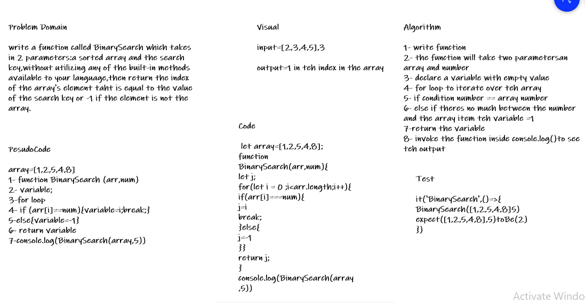

# Binary Search of Sorted Array

write a function called BinarySearch which takes in 2 parameters:a sorted array and the search key,without utilizing any of the built-in methods available to your language,then return the index of the array's element taht is equal to the value of the search key or -1 if the element is not the array.

## Whiteboard Process

## Approach & Efficiency

* *create a function*
* *declare 2 variables highvalue and lowvalue*
* *use while and if else*
* *then return*