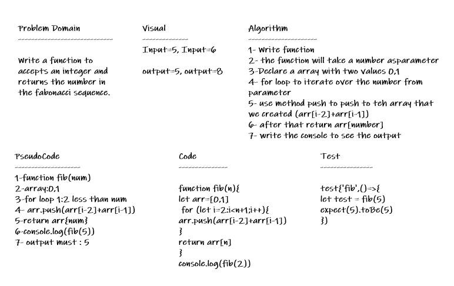

# Fibonacci-sequence

Write a function to accepts an integer and returns the number in the fabonacci sequence.

## Whiteboard Process

## Approach & Efficiency

* create a function

* for loop over it an push to the arr

* return the arr