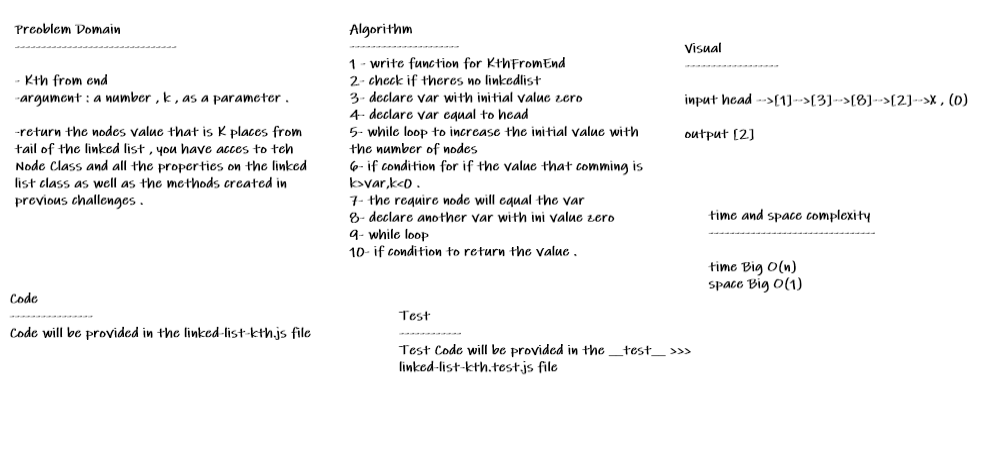

# linked-list-kth
**insert before : and insert after**
- Kth from end 
- argument : a number , k , as a parameter .

- return the nodes value that is K places from tail of the linked list , you have acces to teh Node Class and all the properties on the linked list class as well as the methods created in previous challenges .

## Whiteboard Process

## Approach & Efficiency
* *i undertand the problem first*
* *I imagined how the results should be*
* *I wrote the code*
* *I made the tests*

## API

* *include(): this method compare input value if it's exist in linked list.*
* *Insert(): which takes value of type any adding new node with the input value to the list.*
* *toString(): return a string visiulizing the linked list shape.*

## Solution
