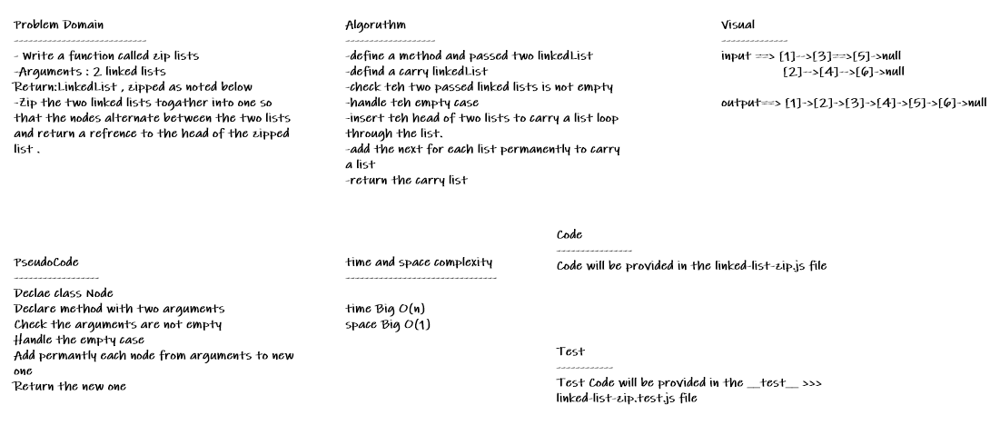

# linked-list-zip

- Write a function called zip lists
- Arguments : 2 linked lists
- Return:LinkedList , zipped as noted below
- Zip the two linked lists togather into one so that the nodes alternate between the two lists and return a refrence to the head of the zipped list .

## Whiteboard Process

## Approach & Efficiency
* *i undertand the problem first*
* *I imagined how the results should be*
* *I wrote the code*
* *I made the tests*

## API

* *append():zipList(): takes two linked lists as arguments and zip them togther so that the nodes alternate between the two lists and return a reference to the head of the zipped list.*

## Solution
