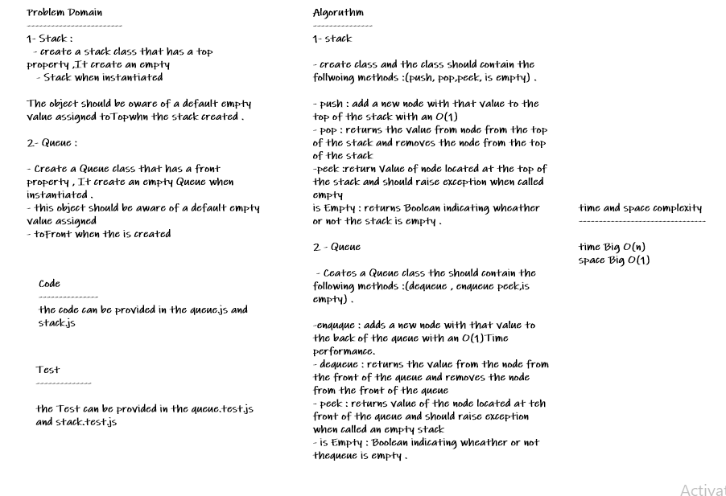

# Stack-and-Queue

**1- Stack :**
  - create a stack class that has a top property ,It create an empty 
   - Stack when instantiated

The object should be oware of a default empty value assigned toTopwhn the stack created .

**2- Queue :** 

- Create a Queue class that has a front property , It create an empty Queue when instantiated .
- this object should be aware of a default empty value assigned 
- toFront when the is created

## Whiteboard Process

## Approach & Efficiency
* *i undertand the problem first*
* *I imagined how the results should be*
* *I wrote the code*
* *I made the tests*

## API

**stack**

* *push(value) : adds a new node with that value to the top of the stack with an O(1) Time performance.*
* *pop() : Removes the node from the top of the stack*
* *peek() : Returns the Value of the node located at the top of the stack*
* *isEmpty() : Returns a boolean indicating whether or not the stack is empty.*

**queue**

* *enqueue(value) : adds a new node with that value to the back of the queue*
* *with an O(1) Time performance.*
* *dequeue() : Removes the node from the front of the queue*
* *peek() : Returns the Value of the node located at the front of the queue*
* *isEmpty() : Returns a boolean indicating whether or not the queue is empty*

