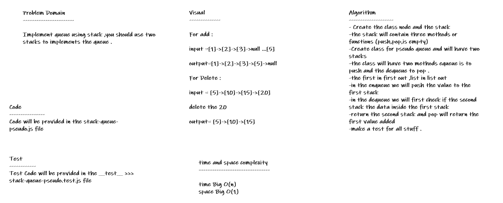

# stack-queue-pseudo

* *Implement queue using stack ,you should use two stacks to implements the queue .*

## Whiteboard Process

## Approach & Efficiency
* *i undertand the problem first*
* *I imagined how the results should be*
* *I wrote the code*
* *I made the tests*
* *then I check the test (npm test)*

### enqueue:

* *Time: O(1)*
* *Space: O(1)*

### dequeue:

* *Time: O(n)*
* *Space: O(n)*

## API

**stack**

* *push(value) : adds a new node with that value to the top of the stack with an O(1) Time performance.*
* *pop() : Removes the node from the top of the stack*
* *peek() : Returns the Value of the node located at the top of the stack*
* *isEmpty() : Returns a boolean indicating whether or not the stack is empty.*

**queue**

* *enqueue(value) : adds a new node with that value to the back of the queue*
* *with an O(1) Time performance.*
* *dequeue() : Removes the node from the front of the queue*
* *peek() : Returns the Value of the node located at the front of the queue*
* *isEmpty() : Returns a boolean indicating whether or not the queue is empty*

