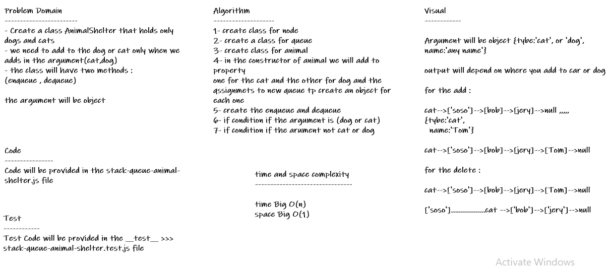

# stack-queue-animal-shelter

* *Implement the following methods: enqueue(animal): adds animal to the shelter. animal can be either a dog or a cat object. dequeue(pref): returns either a dog or a cat. If pref is not "dog" or "cat" then return null.*

## Whiteboard Process

## Approach & Efficiency
* *i undertand the problem first*
* *I imagined how the results should be*
* *I wrote the code*
   * *make a constructor that createss a new array for each shelter*
   * *create a class "animal" with a constructor that handles the types of animals*
   * *write and enqueue method that creaters a new animal and pushes it into the shelter*
   * *write a dequeue method that removes the first animal of specified pref*
* *I made the tests*
* *then I check the test (npm test)*

### enqueue:

* *Time: O(1)*
* *Space: O(1)*

### dequeue:

* *Time: O(n)*
* *Space: O(n)*

## API

* *enqueue(animal) : add object into the AnimalShelter, using a lastin last out approach.*
* *dequeue(pref) : Removes the object from the front of the AnimalShelter*