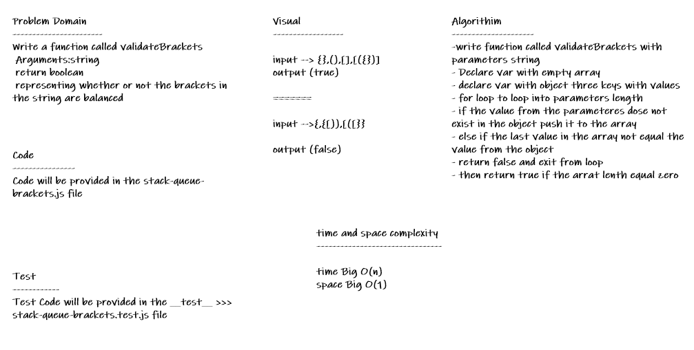

# stack-queue-brackets

* *Your function should take a string as its only argument, and should return a boolean representing whether or not the brackets in the string are balanced. There are 3 types of brackets:* 
1- Round Brackets : ()
2- Square Brackets : []
3- Curly Brackets : {}

## Whiteboard Process

## Approach & Efficiency
* *i undertand the problem first*
* *I imagined how the results should be*
* *I wrote the code*
   * *Write a function called validateBrackets*
   * *Arguments:string*
   * *return boolean*
   * *representing whether or not the brackets in the string are balanced*
* *I made the tests*
* *then I check the test (npm test)*

## API

* *validateBrackets(str) : check whether or not the brackets in the string are balanced*