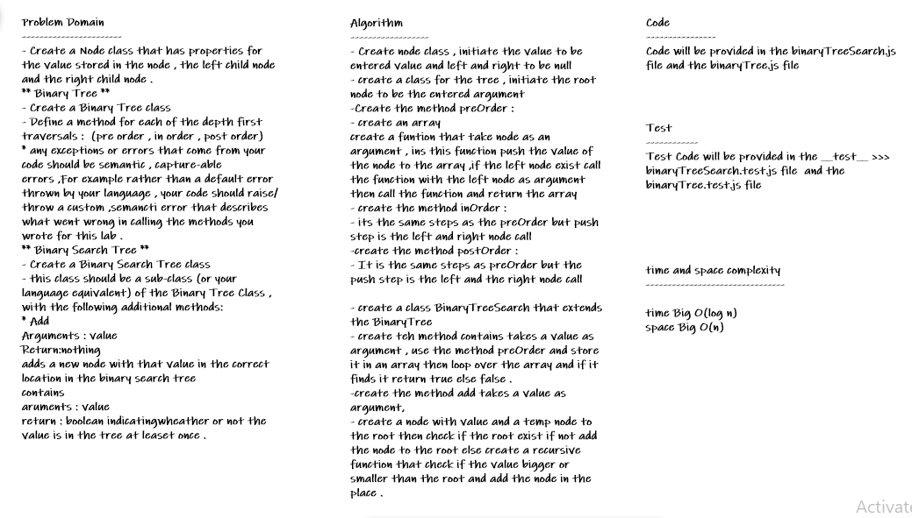

# trees

* *Create a Node class that has properties for the value stored in the node, the left child node, and the right child node.*

## Whiteboard Process

## Approach & Efficiency
* *i undertand the problem first*
* *I imagined how the results should be*
* *I wrote the code*
   * **more details in the algorthim**
* *I made the tests*
* *then I check the test (npm test)*

### BinaryTree :

* *preOrder() time : O(log n) , space O(n)*
* *inOrder() time : O(log n) , space O(n)*
* *postOrder() time : O(log n) , space O(n)*

### BinarySearchTree :

* *contains(value) : time : O(n) , space O(n)*
* *add(value) : time O(n), spaceO(n)*

## API

### Binary Tree :
      * preOder() : Root -> Left -> Right
      * postOrder() : Left -> Right -> Root
      * inPrder() : Left -> Root -> Right

### Binary Search Tree:

     * addValue(value) : add value to the tree

     * contains(value) : check if the tree contains this value at least one time.