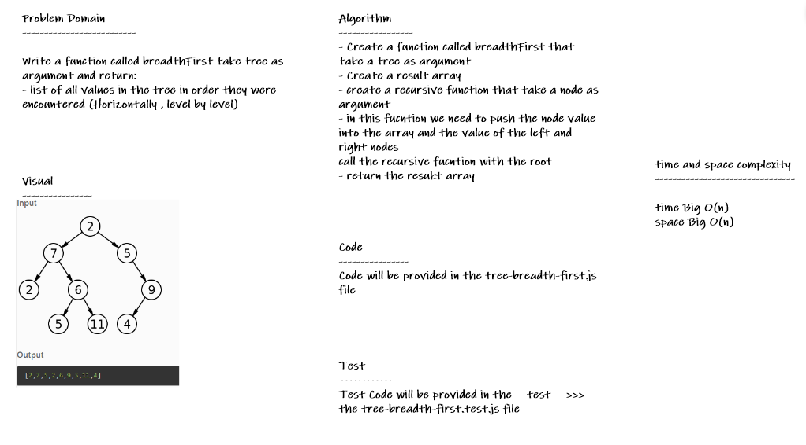

# tree-breadth-first

* *Write Write a function called breadth first Return: list of all values in the tree, in the order they were encountered*

## Whiteboard Process

## Approach & Efficiency

* *i undertand the problem first*
* *I imagined how the results should be*
* *I wrote the code*
* *I made the tests*
* *then I check the test (npm test)*

## API

* *breadthFirst(tree) : returns a list of all values in the tree level by level*
