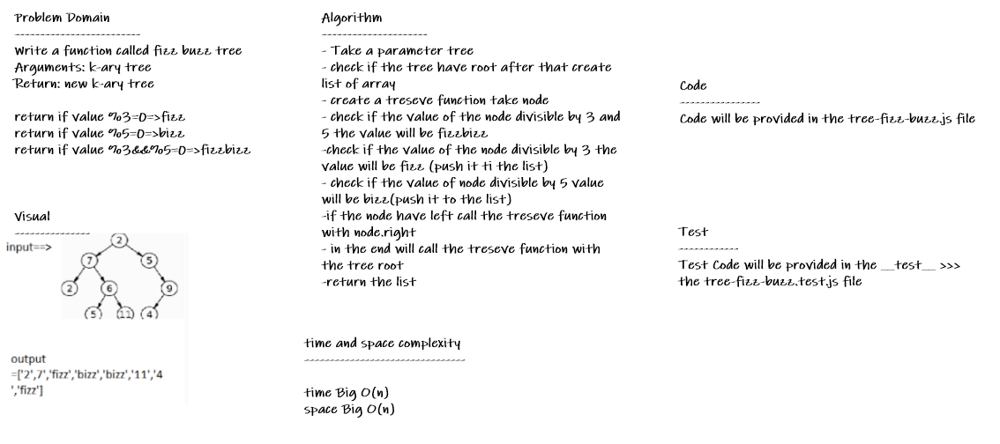

# tree-fizz-buzz

* *Write a function called fizz buzz tree, Arguments: k-ary tree ,Return: new k-ary tree*

## Whiteboard Process

## Approach & Efficiency

* *i undertand the problem first*
* *I imagined how the results should be*
* *I wrote the code*
* *I made the tests*
* *then I check the test (npm test)*

## API

* *fizzBuzzTree (tree) : return new tree with Buzz or Fizz or FizzBuzz or its value.*
