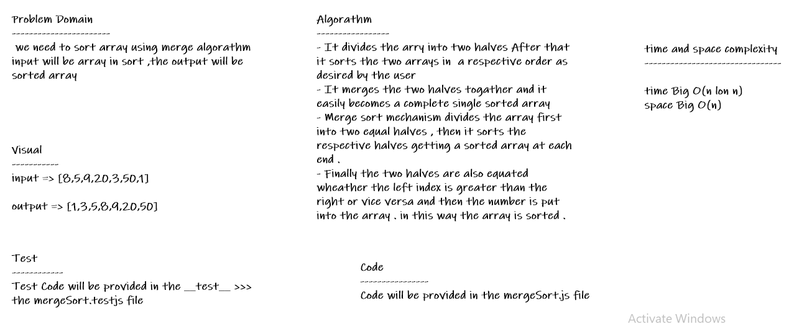
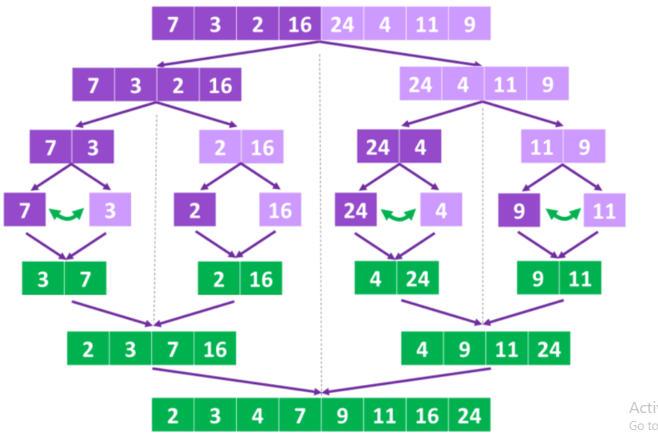

# Merge Sort

* *we need to sort array using merge algorathm input will be array in sort ,the output will be sorted array*

## Whiteboard Process

## Approach & Efficiency

* *i undertand the problem first*
* *I imagined how the results should be*
* *I wrote the code*
* *I made the tests*
* *then I check the test (npm test)*

## Trace Steps

