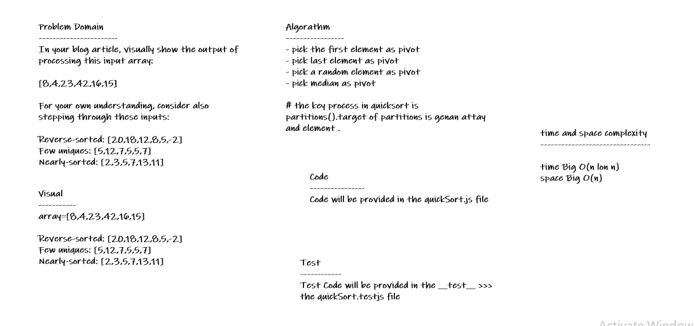
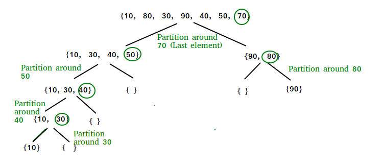

# Quick Sort

* *Quick sort is a sorting algorithm that splits up an array into equal parts and sets a pointer to both ends of the array and a pivot in the middle of the array. If the left value is greater than the pivot and the right is less than the pivot they are swapped.*

## Whiteboard Process

## Approach & Efficiency

* *i undertand the problem first*
* *I imagined how the results should be*
* *I wrote the code*
* *I made the tests*
* *then I check the test (npm test)*

## Trace Steps

