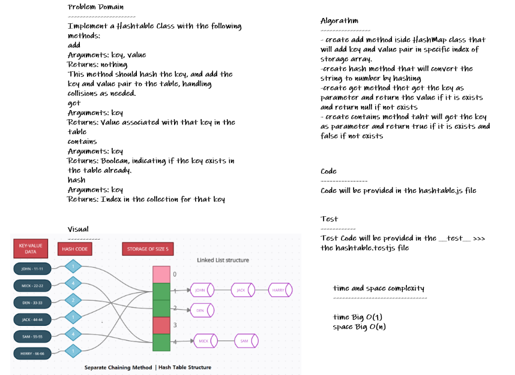

# Hashtables

* *create Hashtable class implements a hashtable, which maps keys to values. It inherits Dictionary class and implements the Map interface.*

## Whiteboard Process

## Approach & Efficiency

* *i undertand the problem first*
* *I imagined how the results should be*
* *I wrote the code*
* *I made the tests*
* *then I check the test (npm test)*

## API

**add(key, value)**

* *takes in both the key and value, hashes the key, and adds the key and value pair to the table, handling collisions as needed*

**get(key)**

* *takes in the key and returns the value from the table or an array of values if the key has multiple pairs*

**contains(key)**

* *takes in the key and returns a boolean, indicating if the key exists in the table already*

**hash(key)**

* *takes in an arbitrary key and returns an index in the collection*
