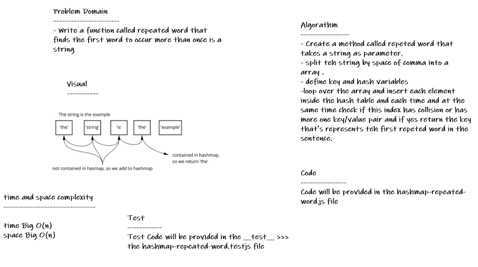

# hashmap-repeated-word

* *Write a function called repeated word that finds the first word to occur more than once in a string,Arguments string and Return string.*

## Whiteboard Process

## Approach & Efficiency

* *i undertand the problem first*
* *I imagined how the results should be*
* *I wrote the code*
* *I made the tests*
* *then I check the test (npm test)*

## API

**Hashtable**

* *repeatedWord(string) : This method Finds the most repeated word in a book.*

