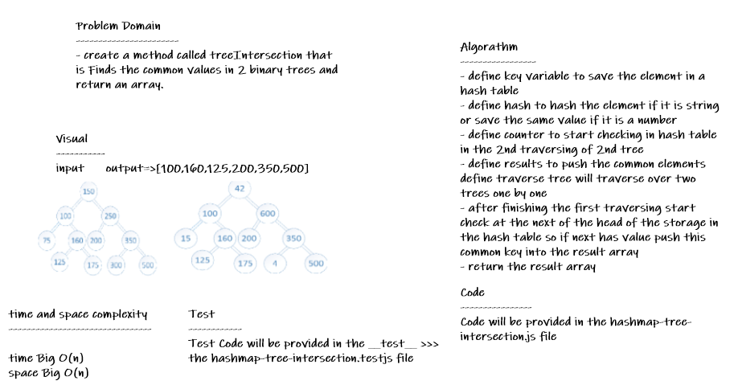

# hashmap-tree-intersection

* *create a method called treeIntersection that is Finds the common values in 2 binary trees and return an array.*

## Whiteboard Process

## Approach & Efficiency

* *i undertand the problem first*
* *I imagined how the results should be*
* *I wrote the code*
* *I made the tests*
* *then I check the test (npm test)*

## API

**Hashtable**

* *repeatedWord(string) : This method Finds the most repeated word in a book.*

