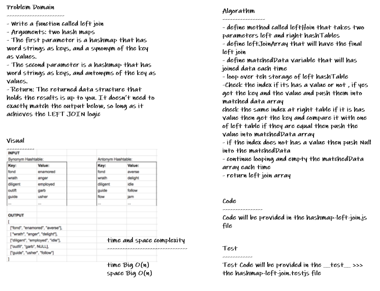

# hashmap-left-join

* *create a method called leftJoin that is takes two hashmaps and returns new data, all left hash and the matching ones from right hash.*

## Whiteboard Process

## Approach & Efficiency

* *i undertand the problem first*
* *I imagined how the results should be*
* *I wrote the code*
* *I made the tests*
* *then I check the test (npm test)*

## API

**Hashtable**

* *leftJoin(leftHash, rightHash) : This method LEFT JOINs two hashmaps into a single data structure.*

